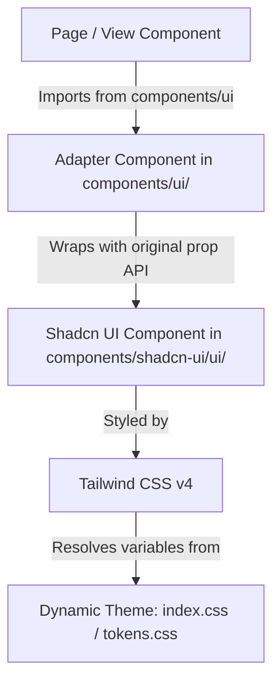

# Design Spec: Shadcn UI Component Migration

This design spec outlines the technical approach to migrate the custom inline-styled React components in the Datacon application to standard, Tailwind-styled **Shadcn UI** components. This will improve layout responsiveness, visual quality, and UI accessibility while maintaining the dynamic runtime theme-switching features.

---

## 1. Architectural Strategy: Component Adapter Pattern

To minimize changes and prevent compilation issues in the dozens of files importing from `@/components/ui`, we will use the **Adapter Pattern**. 

Instead of rewriting import statements in every view, we will modify the files inside `app/web/src/components/ui/` in-place. These files will retain their original export names and prop signatures but will wrap and render Shadcn UI components under the hood.



---

## 2. Dynamic Theme Integration & Tailwind Mapping

Datacon supports dynamic themes (Purple, Emerald, Sapphire, Sunset, and Custom Accent). When a user changes themes, CSS variables (like `--ac` for accent, `--ac-border` for borders, and `--ac-soft` for background highlights) are modified on `document.documentElement` via `useThemeStore`.

To ensure Shadcn components respond dynamically to these runtime theme changes, we will update the `@theme inline` block and root variables in `app/web/src/index.css`.

### Proposed Variable Re-mappings in `app/web/src/index.css`
```css
:root {
  /* Dynamic Shadcn/Tailwind Theme Re-mappings */
  --primary: var(--ac);                      /* Map Tailwind primary to active accent */
  --primary-foreground: oklch(1 0 0);        /* Always white text on primary backgrounds */
  
  --border: var(--ac-border);                /* Map border color to active theme border */
  --input: var(--ac-border);                 /* Map input borders */
  --ring: var(--ac-ring);                    /* Map focus ring */
  
  --secondary: var(--ac-bg-muted);           /* Map secondary color to soft background */
  --secondary-foreground: var(--ac-fg);      /* Secondary text */
  
  --accent: var(--ac-soft);                  /* Hover/Active states */
  --accent-foreground: var(--ac-fg);
  
  /* Keep standard layout properties */
  --background: oklch(1 0 0);
  --foreground: oklch(0.145 0 0);
  --card: oklch(1 0 0);
  --card-foreground: oklch(0.145 0 0);
  --popover: oklch(1 0 0);
  --popover-foreground: oklch(0.145 0 0);
  --destructive: oklch(0.577 0.245 27.325);
  --radius: 0.625rem;
}
```

---

## 3. Target Component Migration Specifications

### A. Button Component (`app/web/src/components/ui/Button.tsx`)
*   **Original API:** `Button({ variant?: "primary" | "secondary" | "danger" | "ghost", style, disabled, ...rest })`
*   **Shadcn API:** `Button({ variant?: "default" | "destructive" | "outline" | "secondary" | "ghost" | "link", size, asChild })`
*   **Migration Plan:** Wrap the Shadcn button and map the custom prop variants to standard Shadcn variants:
    *   `primary` $\rightarrow$ `default`
    *   `secondary` $\rightarrow$ `outline`
    *   `danger` $\rightarrow$ `destructive`
    *   `ghost` $\rightarrow$ `ghost`

### B. Modal Component (`app/web/src/components/ui/Modal.tsx`)
*   **Original API:** `Modal({ open: boolean, onClose: () => void, width?: number, children: ReactNode })` and `ModalHeader({ title: string, onClose: () => void })`
*   **Shadcn API:** Dialog primitives (`Dialog`, `DialogContent`, `DialogTitle`, `DialogHeader`, etc.)
*   **Migration Plan:** Rewrite `Modal` as a high-level wrapper around the Shadcn `Dialog` component. Render `DialogContent` inside, styling with Tailwind and dynamically sizing the container using inline width styles for backwards compatibility. Utilize `@radix-ui/react-visually-hidden` to provide screen-reader accessible header titles when titles are omitted.

### C. AlertDialog Component (`app/web/src/components/ui/AlertDialog.tsx`)
*   **Original API:** Radix UI wrapper with custom inline CSS styles.
*   **Migration Plan:** Replace entirely with standard Shadcn `AlertDialog` components, styled using Tailwind CSS classes, while keeping the same export names (`AlertDialogOverlay`, `AlertDialogContent`, etc.).

### D. Select Component (`app/web/src/components/ui/select.tsx`)
*   **Original API:** Radix UI wrapper with custom inline CSS styles.
*   **Migration Plan:** Replace entirely with standard Shadcn `Select` components, styled using Tailwind classes, retaining all original exports.

### E. Badges (`app/web/src/components/ui/RoleBadge.tsx` and `StatusBadge.tsx`)
*   **Original API:** Inline style elements styled with custom hardcoded colors.
*   **Migration Plan:** Update both badges to import and wrap the Shadcn `Badge` component, passing styling parameters via Tailwind CSS classes or styled overrides.

---

## 4. Verification & Scope

1.  **TypeScript Verification:** Compile the web workspace by running `npm run build` in `app/web` and resolve any type incompatibilities.
2.  **Theme System Validation:** Test the settings pane and verify that changing accent colors dynamically modifies colors for buttons, select dropdowns, alerts, and badges instantly.
3.  **UI Layout and Responsiveness Check:** Confirm that modals and select dropdowns fit within mobile/tablet screens and do not clip or break formatting on resize.
